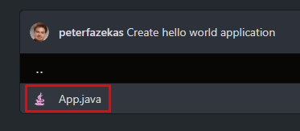

# 2020-hello-world

A jelen repóban 10 branch található
-  main: A readme leírást tartalmazza
-  1-hello-world: Klasszikus "Hello World" program
-  2-preparation: Véletlenszám generálás és a számok kiírása képernyőre
-  3-simple-programming-items: Elemi programozási tételek megvalósítása: Sorozatszámítás, Eldöntés, Kiválasztás, Keresés, Megszámolás, Maximum kiválasztás
-  4-sorts: Összetett programozási tételek (rendezések): Egyszerű cserés rendezés, Buborékos rendezés
-  5-refactor-use-list: Refaktorálás: Lista használata Tömb helyett
-  6-refactor-use-foreach: Refaktorálás: foreach használata klasszikus for ciklus helyett
-  7-refactor-use-stream-api: Refaktorálás: Stream API használata klasszikus ciklusok helyett
-  8-read-from-console: Adatbeolvasás billentyűzetről
-  9-read-and-write-files: Adatok beolvasása, kiírása szöveges állományokba

### Branch váltása


### Kód megtekintése githubon

Miután kiválasztottuk a megfelelő branchet a Code panelen kattuntsunk a
```
src/hu/tutorial
```
elérési útra:


majd az elérési úton belül az
```
App.java
```
állományra: 



És már látható is az állomány tartalma: 

